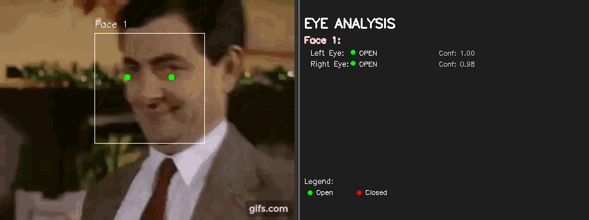
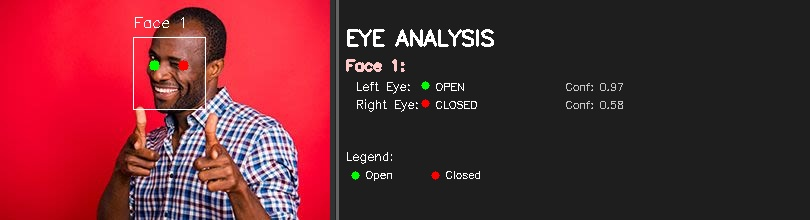

# Eye State Classification Using Multi-Input Fusion Networks

This project implements a real-time eye state classification system that determines whether a person's eyes are open or closed from images or video feeds. The system uses a novel multi-input fusion architecture called FusionNet, which combines visual features from eye regions with geometric features from facial landmarks to achieve robust predictions across multiple faces simultaneously.

<div align="center">
  <table>
    <tr>
      <td align="center">
        <strong>Input</strong><br>
        
      </td>
      <td align="center">
        <strong>Output with Analysis</strong><br>
        
      </td>
    </tr>
  </table>
  <table>
    <tr>
      <td align="center">
        <strong>Input</strong><br>
        
      </td>
      <td align="center">
        <strong>Output with Analysis</strong><br>
        
      </td>
    </tr>
  </table>
</div>

## Overview

The core innovation of this work lies in the FusionNet architecture, which processes multiple heterogeneous input streams in parallel. Unlike traditional approaches that rely solely on visual features, our system combines:

- **Visual Features**: 24×24 grayscale eye region images processed through convolutional layers
- **Geometric Features**: Facial landmark coordinates, inter-landmark distances, and angular relationships processed through 1D convolutional layers

This multi-modal approach enables the system to maintain high accuracy even in challenging conditions such as varying lighting, head poses, and facial expressions.

## Model Architecture

### FusionNet: Multi-Input Fusion Network

FusionNet employs a four-branch architecture where each branch specializes in processing different types of input data:

1. **Image Branch**: Processes 24×24 eye region images through two convolutional layers (32 and 64 filters) with 2×2 max pooling
2. **Keypoint Branch**: Processes 11 facial landmark coordinates through 1D convolutions (8 and 16 filters)
3. **Distance Branch**: Processes distances between landmarks and centroid through 1D convolutions
4. **Angle Branch**: Processes angular relationships between landmarks through 1D convolutions

All branches are concatenated and passed through fully connected layers (128 and 256 neurons with 20% dropout) before the final softmax classification layer.

**Input Specifications:**
- Eye images: (24, 24, 1) - grayscale normalized to [0,1]
- Keypoints: (1, 11, 2) - normalized coordinates
- Distances: (1, 11, 1) - normalized distances
- Angles: (1, 11, 1) - normalized angles in radians

## Dataset

The project uses the [Closed Eyes In The Wild (CEW)](https://parnec.nuaa.edu.cn/_upload/tpl/02/db/731/template731/pages/xtan/ClosedEyeDatabases.html) dataset, specifically the **dataset_B_FacialImages** subset, which contains facial images with corresponding eye coordinate annotations:

```sh
dataset_B_FacialImages/
├── EyeCoordinatesInfo_ClosedFace.txt    # Coordinates for closed eye images
├── EyeCoordinatesInfo_OpenFace.txt      # Coordinates for open eye images
├── ClosedFace/                          # Images with closed eyes
│   ├── closed_eye_0001.jpg_face_1.jpg
│   └── ...
└── OpenFace/                            # Images with open eyes
    ├── Aaron_Guiel_0001.jpg
    └── ...
```

The dataset is automatically downloaded during training and stored in `data/raw/`. The preprocessing pipeline extracts eye regions based on provided coordinates, detects 68 facial landmarks using dlib, and computes geometric features for training.

The shape predictor model for facial landmarks will be downloaded automatically when needed from [dlib](https://dlib.net/files/).

## Installation and Setup

### Prerequisites

- Python ≥ 3.11
- CUDA-compatible GPU (optional, for faster training - ensure TensorFlow compatibility)

### Installation

1. **Clone the repository:**
   ```bash
   git clone https://github.com/ahmedsalim3/eye-analysis.git
   cd eye-analysis
   ```

2. **Install dependencies:**
   ```bash
   uv sync
   source .venv/bin/activate
   ```


## Training

### Quick Start

Train the model using the provided script:

```bash
./scripts/train_model.sh
```

Make sure to adjust the configuration found in [configs/model.conf](./configs/model.conf) if needed.

### Manual Training

For more control over training parameters:

```bash
python -m src.modeling.train \
    --network mi \
    --epochs 50 \
    --batch-size 64 \
    --val-split 0.15 \
    --lr 0.0005 \
    --early-stop 7 \
    --lr-patience 5 \
    --random-state 42
```

### Training Parameters

- `--network`: Architecture type (`mi` for multi-input FusionNet, `si` for single-input)
- `--epochs`: Maximum training epochs (default: 50)
- `--batch-size`: Training batch size (default: 32)
- `--val-split`: Validation set ratio (default: 0.2)
- `--lr`: Initial learning rate (default: 0.001)
- `--early-stop`: Early stopping patience (default: 5)
- `--lr-patience`: Learning rate reduction patience (default: 3)
- `--random-state`: Random seed for reproducibility

### Training Outputs

Training produces the following artifacts:

- `weights/eye_state_model.weights.h5`: Best model weights
- `weights/eye_state_model.h5`: Complete saved model
- `results/training_history.png`: Training and validation curves

## Inference Pipeline

The inference pipeline processes images through the following stages:

1. **Face Detection**: Uses RetinaFace (default) or dlib to detect faces in the input frame
2. **Face Processing**: Crops and normalizes detected face regions to 100×100 pixels
3. **Landmark Detection**: Applies dlib's 68-point facial landmark detector
4. **Eye Feature Extraction**: Extracts eye regions and computes geometric features
5. **Classification**: Applies FusionNet to predict eye states
6. **Post-processing**: Applies confidence thresholds and temporal smoothing

### Usage Examples

**Process a single image:**
```bash
python main.py input/test.jpg
```

**Process video file:**
```bash
python main.py input/video.mp4
```

**Real-time webcam processing:**
```bash
python main.py webcam --camera_id 0
```

**Advanced options:**
```bash
python main.py input/image.jpg \
    --weights weights/eye_state_classifier.h5 \
    --confidence_threshold 0.5 \
    --partial_threshold_high 0.75 \
    --partial_threshold_low 0.55
```

### Programmatic Usage

```python
from src.modules.pipeline import Pipeline
from src.utilities.vis_utils import render
import cv2
import pathlib

# Initialize pipeline
pipeline = Pipeline(
    weights=pathlib.Path("weights/eye_state_classifier.h5"),
    shape_predictor=pathlib.Path("weights/shape_predictor_68_face_landmarks.dat"),
    detector="retinaface",
    device="cpu",
    confidence_threshold=0.5
)

# Process frame
frame = cv2.imread("input/test.jpg")
results = pipeline.step(frame)

# Generate visualization
output = render(frame, results, draw_landmarks=False, 
               detector_type=pipeline.detector_type)

# Access predictions
for i in range(len(results)):
    left_state = results.left_states[i]
    right_state = results.right_states[i]
    left_conf = results.left_confidences[i]
    right_conf = results.right_confidences[i]
    
    print(f"Face {i+1}: Left={left_state}({left_conf:.2f}), Right={right_state}({right_conf:.2f})")
```